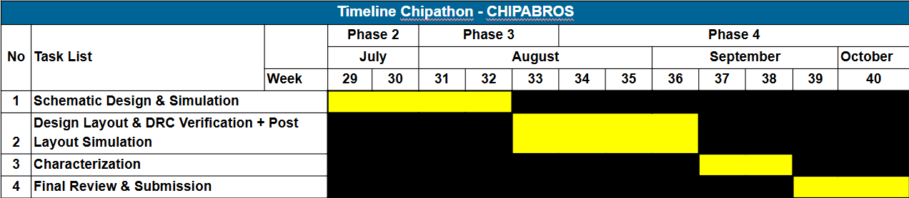

# SSCS Chipathon 2025 - Digital Building Blocks: OSU Library Extension

**Track:** Digital Building Blocks  
**Team:** CHIPABROS  
**Members:** Karunia Muda Kurniawan (Team Leader), M. Ahza Bayanaka Wijanarko, Akmal Hafizh Musyaffa, and M. Azfar A. Yusup

---

## 1. Project Overview

This project is our team's contribution to the **IEEE SSCS Chipathon 2025**. We are participating in the **Digital Building Blocks** track with the primary goal of extending the open-source Oklahoma State University (OSU) 3.3V standard cell library for the GlobalFoundries 180nm (GF180MCU) PDK.

Our objective is to design, characterize, and contribute a set of new, high-value complex logic gates. The addition of these cells will enhance the library's functionality, allowing synthesis tools to produce designs with improved Power, Performance, and Area (PPA) metrics.

---

## 2. Project Goal

We aim to enhance the OSU standard cell library by designing and adding the following cells:
* `AOI33` (AND-OR-Invert 3-3)
* `OAI33` (OR-AND-Invert 3-3)
* `MUX4` (4-to-1 Multiplexer)

By providing these cells as single, optimized units, we enable synthesis tools to bypass the inefficient process of constructing them from smaller, basic gates. This leads to significant improvements in transistor count, circuit delay, and overall layout density.

---

## 3. Proposed Cell Designs

Our design philosophy is centered on creating efficient, single-stage complex gates to maximize PPA gains.

### AOI33 (AND-OR-Invert)
* **Logic Function:** `Y = ~((A & B & C) | (D & E & F))`
* **Design:** Implemented as a single-stage, **12-transistor complementary CMOS complex gate**. This design is vastly more efficient than a multi-gate equivalent, which would require ~24 transistors and introduce additional delay.
* **Schematic:**
    

* **Target Specifications:**

| Specification | Target Value |
| :--- | :--- |
| Drive Strength | `1x` |
| Track | `9T` |
| VDD | `3.3 V` |
| Input Capacitance | &le; 0.01 pF |
| Leakage Power | &le; 0.5 nW |
| Area | &le; 50&micro;m&sup2; |
| Delay @FO4 | &le; 0.3 ns |

### OAI33 (OR-AND-Invert)
* **Logic Function:** `Y = ~((A | B | C) & (D | E | F))`
* **Design:** Implemented as a single-stage, **12-transistor complementary CMOS complex gate**, leveraging CMOS duality to create a compact and performant layout.
* **Schematic:**

  

* **Target Specifications:**

| Specification | Target Value |
| :--- | :--- |
| Drive Strength | `1x` |
| Track | `9T` |
| VDD | `3.3 V` |
| Input Capacitance | &le; 0.01 pF |
| Leakage Power | &le; 0.5 nW |
| Area | &le; 50&micro;m&sup2; |
| Delay @FO4 | &le; 0.3 ns |

### MUX4 (4-to-1 Multiplexer)
* **Logic Function:** Selects one of four data inputs (`x0`-`x3`) based on two select lines (`C0`, `C1`).
* **Design:** Implemented using **Transmission Gate Logic (TGL)**. This topology was chosen for its minimal transistor count, excellent performance, and its ability to pass a full rail-to-rail voltage swing, which is a critical requirement for robust standard cell design.
* **Schematic:**
    

* **Target Specifications:**

| Specification | Target Value |
| :--- | :--- |
| Drive Strength | `1x` |
| Track | `9T` |
| VDD | `3.3 V` |
| Input Capacitance | &le; 0.01 pF |
| Leakage Power | &le; 0.5 nW |
| Area | &le; 60&micro;m&sup2; |
| Delay @FO4 | &le; 0.3 ns |

---

## 4. Application & Impact

These cells are fundamental building blocks in modern digital design and are widely applied in:
* **Control Logic:** Implementing complex state machines and decision logic.
* **Arithmetic Units:** Building adders, multipliers, and other computational circuits.
* **Data Path & Multiplexing:** Efficiently routing data buses and selecting signal paths.

By contributing these optimized cells, we anticipate that future projects using the OSU library will achieve more compact layouts and higher clock speeds.

---

## 5. Tools and Methodology

Our workflow utilizes a combination of open-source and industry-standard EDA tools.

* **Schematic Entry:** Xschem
* **Layout & Verification:** Magic, KLayout, Netgen
* **Simulation:** NGSpice
* **Characterization:** We will use **Charlib**, an open-source library characterization tool, to generate the `.lib` (Liberty) timing and power models for our cells.

Our final validation will involve a side-by-side comparison of a benchmark circuit synthesized with the original OSU library versus our new, augmented library to quantitatively measure the PPA improvements.

---

---

## 6. Timeline

---

---

## 7. Work Distribution

| Member     | Task Distribution |
|------------|-------------------|
| **Karunia Muda Kurniawan** |                   |
| **M. Ahza Bayanaka Wijanarko** |                   |
| **Akmal Hafizh Musyaffa** |                   |
| **M. Azfar A. Yusup** |                   |

---

**Status:** In Progress 🚧
