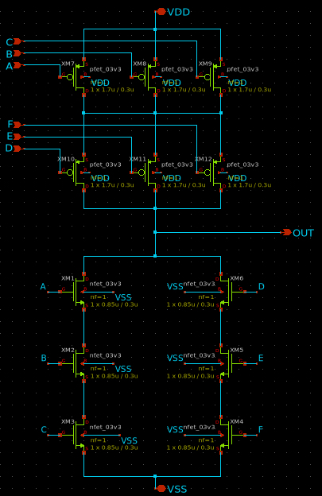

> [!IMPORTANT]
> > **Last Updated: 10 August 2025**
> >
> > Update notes: We have added section 8 (after work distribution in README.md), which contains the results of our schematic simulations.

---

# SSCS Chipathon 2025 - Digital Building Blocks: OSU Library Extension

**Track:** Digital Building Blocks  
**Team:** CHIPABROS  
**Members:** Karunia Muda Kurniawan (Team Leader), M. Ahza Bayanaka Wijanarko, Akmal Hafizh Musyaffa, and M. Azfar A. Yusup

---

## 1. Project Overview

This project is our team's contribution to the **IEEE SSCS Chipathon 2025**. We are participating in the **Digital Building Blocks** track with the primary goal of extending the open-source Oklahoma State University (OSU) 3.3V standard cell library for the GlobalFoundries 180nm (GF180MCU) PDK.

Our objective is to design, characterize, and contribute a set of new, high-value complex logic gates. The addition of these cells will enhance the library's functionality, allowing synthesis tools to produce designs with improved Power, Performance, and Area (PPA) metrics.

---

## 2. Project Goal

We aim to enhance the OSU standard cell library by designing and adding the following cells:
* `AOI33` (AND-OR-Invert 3-3)
* `OAI33` (OR-AND-Invert 3-3)
* `MUX4` (4-to-1 Multiplexer)

By providing these cells as single, optimized units, we enable synthesis tools to bypass the inefficient process of constructing them from smaller, basic gates. This leads to significant improvements in transistor count, circuit delay, and overall layout density.

---

## 3. Proposed Cell Designs

Our design philosophy is centered on creating efficient, single-stage complex gates to maximize PPA gains.

### AOI33 (AND-OR-Invert)
* **Logic Function:** `Y = ~((A & B & C) | (D & E & F))`
* **Design:** Implemented as a single-stage, **12-transistor complementary CMOS complex gate**. This design is vastly more efficient than a multi-gate equivalent, which would require ~24 transistors and introduce additional delay.
* **Schematic:**

  

* **Target Specifications:**

| Specification | Target Value |
| :--- | :--- |
| Drive Strength | `1x` |
| Track | `9T` |
| VDD | `3.3 V` |
| Input Capacitance | ≤ 0.01 pF |
| Leakage Power | ≤ 0.5 nW |
| Area | ≤ 50µm² |
| Delay @FO4 | ≤ 0.3 ns |

### OAI33 (OR-AND-Invert)
* **Logic Function:** `Y = ~((A | B | C) & (D | E | F))`
* **Design:** Implemented as a single-stage, **12-transistor complementary CMOS complex gate**, leveraging CMOS duality to create a compact and performant layout.
* **Schematic:**

  

* **Target Specifications:**

| Specification | Target Value |
| :--- | :--- |
| Drive Strength | `1x` |
| Track | `9T` |
| VDD | `3.3 V` |
| Input Capacitance | ≤ 0.01 pF |
| Leakage Power | ≤ 0.5 nW |
| Area | ≤ 50µm² |
| Delay @FO4 | ≤ 0.3 ns |

### MUX4 (4-to-1 Multiplexer)
* **Logic Function:** Selects one of four data inputs (`x0`-`x3`) based on two select lines (`C0`, `C1`).
* **Design:** Implemented using **Transmission Gate Logic (TGL)**. This topology was chosen for its minimal transistor count, excellent performance, and its ability to pass a full rail-to-rail voltage swing, which is a critical requirement for robust standard cell design.
* **Schematic:** **(Update: The Body of NMOS Should Be Connected to GND and the Body of PMOS Should Be Connected To VDD)**

  

* **Target Specifications:**

| Specification | Target Value |
| :--- | :--- |
| Drive Strength | `1x` |
| Track | `9T` |
| VDD | `3.3 V` |
| Input Capacitance | ≤ 0.01 pF |
| Leakage Power | ≤ 0.5 nW |
| Area | ≤ 60µm² |
| Delay @FO4 | ≤ 0.3 ns |

---

## 4. Application & Impact

These cells are fundamental building blocks in modern digital design and are widely applied in:
* **Control Logic:** Implementing complex state machines and decision logic.
* **Arithmetic Units:** Building adders, multipliers, and other computational circuits.
* **Data Path & Multiplexing:** Efficiently routing data buses and selecting signal paths.

By contributing these optimized cells, we anticipate that future projects using the OSU library will achieve more compact layouts and higher clock speeds.

---

## 5. Tools and Methodology

Our workflow utilizes a combination of open-source and industry-standard EDA tools.

* **Schematic Entry:** Xschem
* **Layout & Verification:** Magic, KLayout, Netgen
* **Simulation:** NGSpice
* **Characterization:** We will use **Charlib**, an open-source library characterization tool, to generate the `.lib` (Liberty) timing and power models for our cells.

Our final validation will involve a side-by-side comparison of a benchmark circuit synthesized with the original OSU library versus our new, augmented library to quantitatively measure the PPA improvements.

---

## 6. Timeline

---

## 7. Work Distribution

| Member     | Task Distribution |
|------------|-------------------|
| **Karunia Muda Kurniawan** | OAI33 design schematic and layout |
| **M. Ahza Bayanaka Wijanarko** | AOI33 design schematic and layout |
| **Akmal Hafizh Musyaffa** | MUX4 design schematic and layout |
| **M. Azfar A. Yusup** | MUX4 design schematic and layout |

---

## 8. Schematic Simulations

This section presents the simulation results for our proposed cell designs. All schematics were designed and simulated in **Xschem** using the GF180MCU PDK.

* **Reference:** Based on 9T OSU standard cell.
* **Goal:** Balanced LH/HL delay via mobility compensation.
* **Sizing Strategy:** For designs that implement PUN and PDN, we consider sizing based on the worst-case path delay.

### AOI33 Simulation

**Schematic**

**Waveform**

**Results**

* **PMOS = 3.4/0.3**
* **NMOS = 2.55/0.3**

<table border="1">
<thead>
<tr>
<th>Input Slew (ps)</th>
<th>Case (t_plh)</th>
<th>Input Configuration (t_plh)</th>
<th>t_plh (ps)</th>
<th>Case (t_phl)</th>
<th>Input Configuration (t_phl)</th>
<th>t_phl (ps)</th>
<th>t_pd (ps)</th>
</tr>
</thead>
<tbody>
<tr>
<td>20</td>
<td rowspan="5">Worst-Case t_plh (C → OUT)</td>
<td rowspan="5">C: 1→0, A=1, B=1, C=1, D=0, E=1</td>
<td>212.361</td>
<td rowspan="5">Worst-Case t_phl (F → OUT)</td>
<td rowspan="5">F: 0→1, A=0, B=0, C=0, D=1, E=1</td>
<td>267.430</td>
<td>239.896</td>
</tr>
<tr>
<td>50</td>
<td>215.460</td>
<td>268.640</td>
<td>242.050</td>
</tr>
<tr>
<td>100</td>
<td>217.946</td>
<td>276.040</td>
<td>246.993</td>
</tr>
<tr>
<td>200</td>
<td>217.843</td>
<td>292.720</td>
<td>255.282</td>
</tr>
<tr>
<td>400</td>
<td>219.234</td>
<td>329.260</td>
<td>274.247</td>
</tr>
</tbody>
</table>

**Conclusion**

The simulation results show that ...

### OAI33 Simulation

**Schematic**

**Waveform**

**Results**

* **Results Critical Path Considered**

  * **PMOS = 5.1/0.3**
  * **NMOS = 1.7/0.3**
<table border="1">
<thead>
<tr>
<th>Input Slew (ps)</th>
<th>Case (t_plh)</th>
<th>Input Configuration (t_plh)</th>
<th>t_plh (ps)</th>
<th>Case (t_phl)</th>
<th>Input Configuration (t_phl)</th>
<th>t_phl (ps)</th>
<th>t_pd (ps)</th>
</tr>
</thead>
<tbody>
<tr>
<td>20</td>
<td rowspan="5">Worst-Case t_plh (A → OUT)</td>
<td rowspan="5">A: 1→0, B=0, C=0, D=1, E=0, F=0</td>
<td>210.92</td>
<td rowspan="5">Worst-Case t_phl (D → OUT)</td>
<td rowspan="5">D: 0→1, A=1, B=0, C=0, E=0, F=0</td>
<td>315.68</td>
<td>263.300</td>
</tr>
<tr>
<td>50</td>
<td>215.81</td>
<td>317.04</td>
<td>266.425</td>
</tr>
<tr>
<td>100</td>
<td>221.98</td>
<td>320.47</td>
<td>271.225</td>
</tr>
<tr>
<td>200</td>
<td>229.91</td>
<td>325.56</td>
<td>277.735</td>
</tr>
<tr>
<td>400</td>
<td>241.14</td>
<td>335.63</td>
<td>288.385</td>
</tr>
</tbody>
</table>

* **Results Critical Path NOT Considered (OSU Standard)**

  * **PMOS = 1.7/0.3**
  * **NMOS = 0.85/0.3**
<table border="1">
<thead>
<tr>
<th>Input Slew (ps)</th>
<th>Case (t_plh)</th>
<th>Input Configuration (t_plh)</th>
<th>t_plh (ps)</th>
<th>Case (t_phl)</th>
<th>Input Configuration (t_phl)</th>
<th>t_phl (ps)</th>
<th>t_pd (ps)</th>
</tr>
</thead>
<tbody>
<tr>
<td>20</td>
<td rowspan="5">Worst-Case t_plh (A → OUT)</td>
<td rowspan="5">A: 1→0, B=0, C=0, D=1, E=0, F=0</td>
<td>371.04</td>
<td rowspan="5">Worst-Case t_phl (D → OUT)</td>
<td rowspan="5">D: 0→1, A=1, B=0, C=0, E=0, F=0</td>
<td>291.69</td>
<td>331.365</td>
</tr>
<tr>
<td>50</td>
<td>376.20</td>
<td>293.93</td>
<td>335.065</td>
</tr>
<tr>
<td>100</td>
<td>382.31</td>
<td>298.07</td>
<td>340.190</td>
</tr>
<tr>
<td>200</td>
<td>389.76</td>
<td>303.98</td>
<td>346.870</td>
</tr>
<tr>
<td>400</td>
<td>399.87</td>
<td>314.34</td>
<td>357.105</td>
</tr>
</tbody>
</table>

**Conclusion**

The simulation results indicate that the OAI33 gate, when sized with consideration for the critical path (PMOS = 5.1/0.3, NMOS = 1.7/0.3), successfully meets the target delay specification (≤ 0.3 ns) set in the proposal. Compared to the default OSU standard sizing (PMOS = 1.7/0.3, NMOS = 0.85/0.3), the critical-path-based sizing delivers a significantly lower propagation delay across all tested input slews. This improvement demonstrates that tailoring the transistor dimensions to the worst-case conduction path yields better timing performance than the fixed OSU sizing rule, while still adhering to the functional and electrical constraints defined in the design targets.

### MUX4 Simulation

**Schematic**

**Waveform**

**Results**

* **Results Sizing Variation 1**

  * **PMOS = 0.85/0.3**
  * **NMOS = 0.85/0.3**
<table border="1" cellspacing="0" cellpadding="4">
  <tr>
    <th>Input Slew (ps)</th>
    <th>Input Case</th>
    <th>t_pLH (ps)</th>
    <th>t_pHL (ps)</th>
    <th>t_pd (ps)</th>
    <th>Leakage Curr (A)</th>
    <th>Leakage Power (nW)</th>
  </tr>
  <tr>
    <td rowspan="4">100</td>
    <td>x0 -> Y</td>
    <td>171.099</td>
    <td>149.16</td>
    <td>160.1295</td>
    <td>-2.78E-11</td>
    <td>0.0916575</td>
  </tr>
  <tr>
    <td>x1 -> Y</td>
    <td>173.659</td>
    <td>146.57</td>
    <td>160.1145</td>
    <td>-2.73E-11</td>
    <td>0.09012762</td>
  </tr>
  <tr>
    <td>x2 -> Y</td>
    <td>173.184</td>
    <td>147.78</td>
    <td>160.482</td>
    <td>-2.37E-11</td>
    <td>0.07824564</td>
  </tr>
  <tr>
    <td>x3 -> Y</td>
    <td>175.74</td>
    <td>145.15</td>
    <td>160.445</td>
    <td>-2.68E-11</td>
    <td>0.08859246</td>
  </tr>
</table>

* **Results Sizing Variation 2**

  * **PMOS = 1.7/0.3**
  * **NMOS = 0.85/0.3**
<table border="1" cellspacing="0" cellpadding="4">
  <tr>
    <th>Input Slew (ps)</th>
    <th>Input Case</th>
    <th>t_pLH (ps)</th>
    <th>t_pHL (ps)</th>
    <th>t_pd (ps)</th>
    <th>Leakage Curr (A)</th>
    <th>Leakage Power (nW)</th>
  </tr>
  <tr>
    <td rowspan="4">100</td>
    <td>x0 -> Y</td>
    <td>144.998</td>
    <td>145.479</td>
    <td>145.239</td>
    <td>-2.80E-11</td>
    <td>0.09237954</td>
  </tr>
  <tr>
    <td>x1 -> Y</td>
    <td>146.668</td>
    <td>145.884</td>
    <td>146.276</td>
    <td>-2.75E-11</td>
    <td>0.09088344</td>
  </tr>
  <tr>
    <td>x2 -> Y</td>
    <td>146.279</td>
    <td>145.6795</td>
    <td>145.979</td>
    <td>-2.80E-11</td>
    <td>0.09084306</td>
  </tr>
  <tr>
    <td>x3 -> Y</td>
    <td>145.126</td>
    <td>145.08</td>
    <td>145.103</td>
    <td>-2.71E-11</td>
    <td>0.08930493</td>
  </tr>
</table>

* **Results Sizing Variation 3**

  * **PMOS = 1.7/0.3**
  * **NMOS = 1.7/0.3**
<table>
  <tr>
    <th>Input Slew (ps)</th>
    <th>Input Case</th>
    <th>t_pLH (ps)</th>
    <th>t_pHL (ps)</th>
    <th>t_pd (ps)</th>
    <th>Leakage Curr (A)</th>
    <th>Leakage Power (nW)</th>
  </tr>
  <tr>
    <td rowspan="4">200</td>
    <td>x0 -> Y</td><td>107.569</td><td>117.2</td><td>112.3845</td><td>-2.80E-11</td><td>0.0923802</td>
  </tr>
  <tr>
    <td>x1 -> Y</td><td>112.012</td><td>114.72</td><td>113.366</td><td>-2.76E-11</td><td>0.09095757</td>
  </tr>
  <tr>
    <td>x2 -> Y</td><td>109.915</td><td>113.65</td><td>111.7825</td><td>-2.75E-11</td><td>0.09084207</td>
  </tr>
  <tr>
    <td>x3 -> Y</td><td>114.252</td><td>112.23</td><td>113.241</td><td>-2.71E-11</td><td>0.08930394</td>
  </tr>

  <tr>
    <td rowspan="4">100</td>
    <td>x0 -> Y</td><td>104.884</td><td>108.13</td><td>106.507</td><td>-2.80E-11</td><td>0.0923802</td>
  </tr>
  <tr>
    <td>x1 -> Y</td><td>109.632</td><td>103.84</td><td>106.736</td><td>-2.76E-11</td><td>0.09095757</td>
  </tr>
  <tr>
    <td>x2 -> Y</td><td>107.748</td><td>105.3</td><td>106.524</td><td>-2.75E-11</td><td>0.09084207</td>
  </tr>
  <tr>
    <td>x3 -> Y</td><td>113.831</td><td>100.06</td><td>106.9455</td><td>-2.71E-11</td><td>0.08930394</td>
  </tr>

  <tr>
    <td rowspan="4">50</td>
    <td>x0 -> Y</td><td>105.316</td><td>103.3</td><td>104.308</td><td>-2.80E-11</td><td>0.0923802</td>
  </tr>
  <tr>
    <td>x1 -> Y</td><td>111.502</td><td>98.27</td><td>104.886</td><td>-2.76E-11</td><td>0.09095757</td>
  </tr>
  <tr>
    <td>x2 -> Y</td><td>109.892</td><td>100.74</td><td>105.316</td><td>-2.75E-11</td><td>0.09084207</td>
  </tr>
  <tr>
    <td>x3 -> Y</td><td>115.859</td><td>95.39</td><td>105.6245</td><td>-2.71E-11</td><td>0.08930394</td>
  </tr>

  <tr>
    <td rowspan="4">10</td>
    <td>x0 -> Y</td><td>109.102</td><td>100.77</td><td>104.936</td><td>-2.80E-11</td><td>0.0923802</td>
  </tr>
  <tr>
    <td>x1 -> Y</td><td>114.155</td><td>94.94</td><td>104.5475</td><td>-2.76E-11</td><td>0.09095757</td>
  </tr>
  <tr>
    <td>x2 -> Y</td><td>113.966</td><td>98.01</td><td>105.988</td><td>-2.75E-11</td><td>0.09084207</td>
  </tr>
  <tr>
    <td>x3 -> Y</td><td>118.928</td><td>91.91</td><td>105.419</td><td>-2.71E-11</td><td>0.08930394</td>
  </tr>
</table>

**Conclusion**

The simulation results show that all three sizing variations meet the target delay (≤ 0.3 ns) and leakage (≤ 0.5 nW) specifications. Variation 3 delivers the fastest delay (~104–113 ps), although this variation is still questionable regarding the 1× drive, input capacitance (≤ 0.01 pF), and area (≤ 60 µm²) constraints due to full upsizing. Variation 2 achieves a balanced delay (~145 ps) while reducing the risk of violating capacitance and area limits, making it the preferred choice for meeting all target specifications. Variation 1 meets all limits but has the slowest delay (~160 ps).

---

## 9. Charlib Characterization

Cell characterization is performed using **Charlib** to extract timing and functional parameters for each standard cell.  
The process generates delay plots (rise/fall vs. input slew and output load) and Liberty (`.lib`) files for use in synthesis, place-and-route, and static timing analysis flows.

### AOI33 Timing Characterization

**Delay Plot**  
  
*Delay plot for AOI33 cell showing rising and falling delays across various input slews and output loads.*

**Liberty File**  
[📄AOI33.lib](output/aoi33/aoi33.lib)  
Contains cell definition, pin capacitance, function, and detailed timing/power tables.

**Key Observations**
- Balanced rise/fall delays across the characterized range.
- Suitable for complex logic minimization with low delay penalty.
- Slightly faster fall delay due to pull-down network strength.

### OAI33 Timing Characterization

**Delay Plot**  
  
*Delay plot for OAI33 cell showing rising and falling delays across various input slews and output loads.*

**Liberty File**  
[📄OAI33.lib](output/oai33/oai33.lib)  
Includes pin functions, timing arcs, and power tables for integration into digital design flows.

**Key Observations**
- Well-balanced delay characteristics, making it ideal for performance-critical logic paths.
- Maintains stable delay trend under higher output loads.
- Energy-efficient due to reduced internal switching in certain logic conditions.

### MUX4 Timing Characterization

**Delay Plot**  
  
*Delay plot for MUX4 cell showing propagation delay from data and select inputs to output across varying conditions.*

**Liberty File**  
[📄MUX4.lib](output/mux4/mux4.lib)  
Contains complete multiplexer timing and power characterizations for use in synthesis and STA.

**Key Observations**
- Minimal skew between different input-to-output paths.
- Delay slightly increases when select inputs switch simultaneously with data inputs.
- Well-suited for datapath control logic due to predictable performance.

